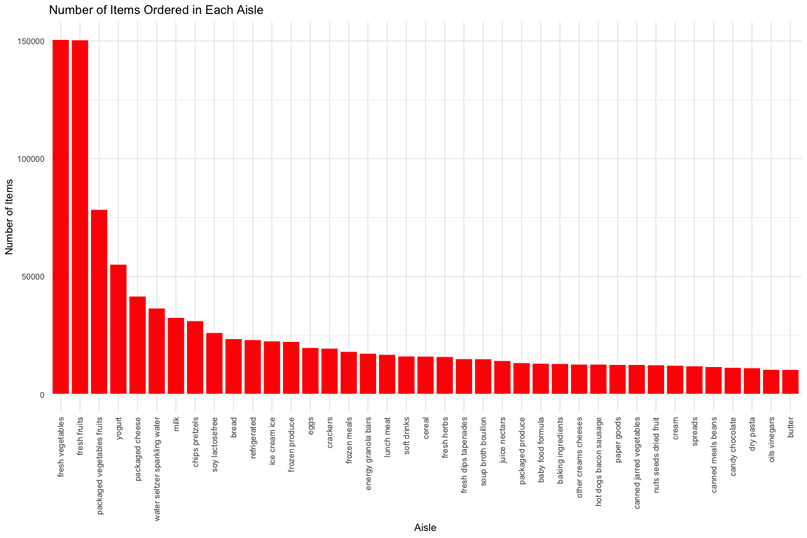
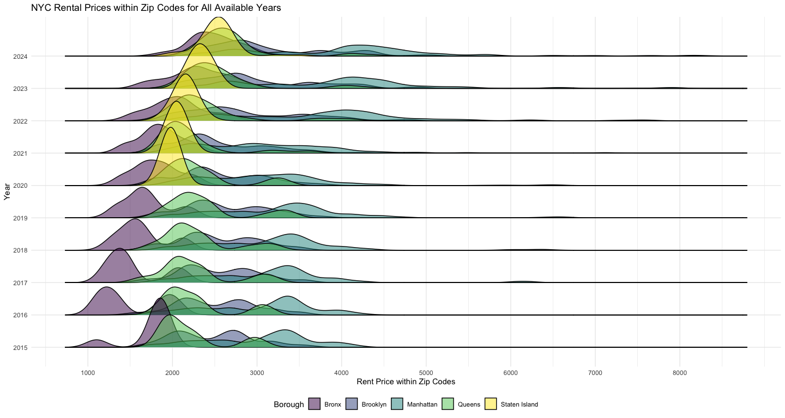
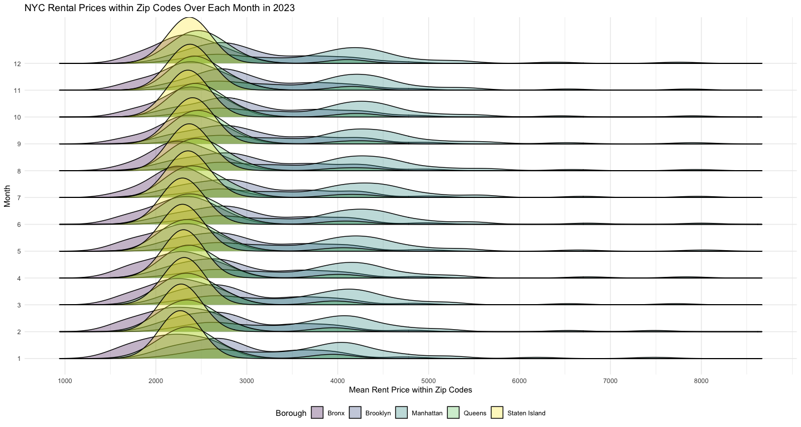
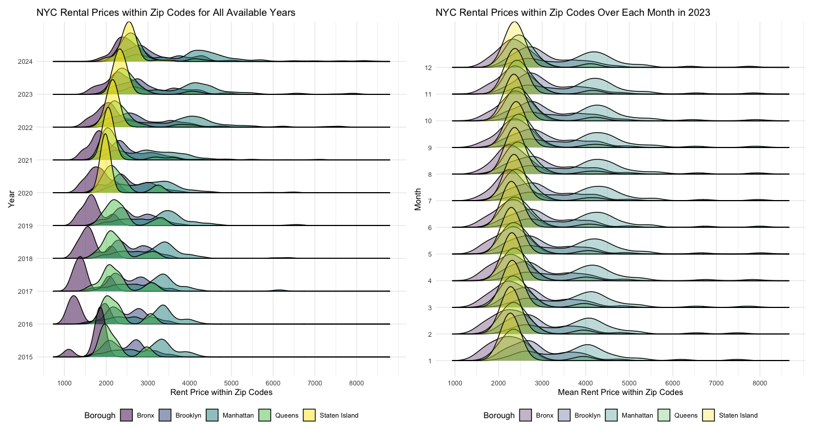
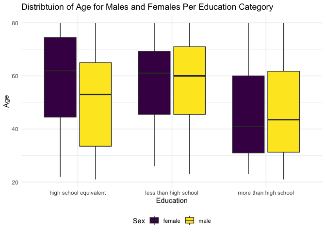
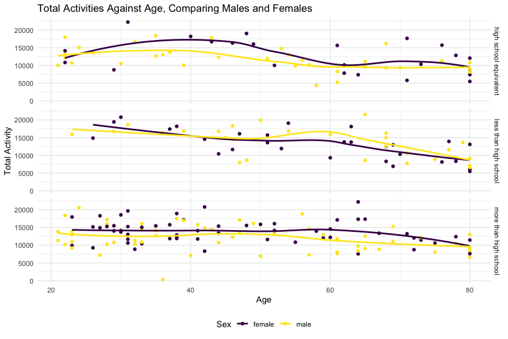
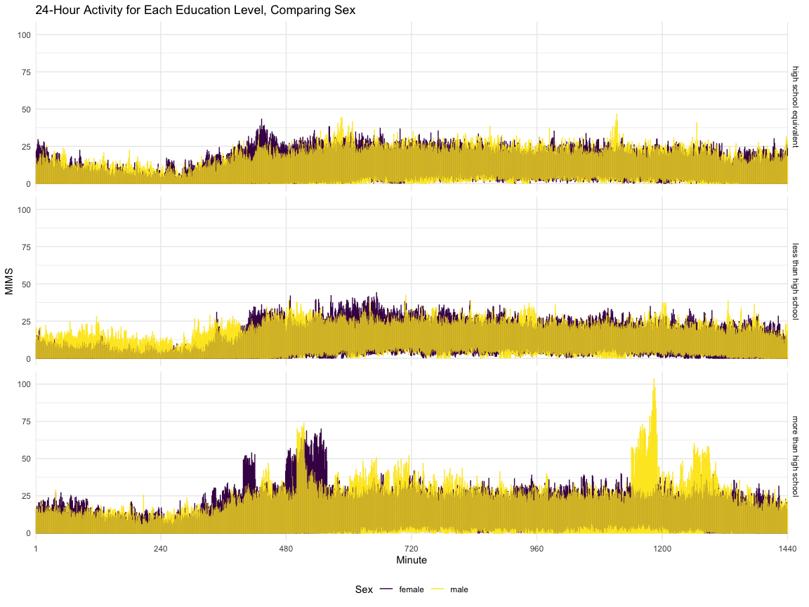

p8105_hw3_ksf2129
================
Kimia Faroughi
2025-10-08

## Problem 1

**Load the dataset**

``` r
library(tidyverse)
library(p8105.datasets)
library(patchwork)
library(ggridges)
data("instacart")

theme_set(theme_minimal() + theme(legend.position = "bottom"))

options(
  ggplot2.continuous.colour = "viridis",
  ggplot2.continuous.fill = "viridis"
)
scale_colour_discrete = scale_colour_viridis_d
scale_fill_discrete = scale_fill_viridis_d
```

There are 1384617 rows (observations) and 15 columns (variables) in the
`instacart` dataset. Each row in the dataset is a unique product from an
order from instacart. Variable names in this dataset include: order_id,
product_id, add_to_cart_order, reordered, user_id, eval_set,
order_number, order_dow, order_hour_of_day, days_since_prior_order,
product_name, aisle_id, department_id, aisle, department. Some variables
of note are `product_id` (the product identifier), `user_id` (the
customer identifier), `product_name` (name of the product ordered),
`aisle` (name of the aisle the product is in), and `department` (name of
the department the product is in). For example, for the product `49302`
and customer `112108`, the product ordered was `Bulgarian Yogurt`, which
was in the `dairy eggs` department in the `yogurt` aisle.

**Explore dataset further**

There are 134 different (unique) aisles in the dataset.

``` r
instacart |> 
  group_by(aisle) |> 
  summarize(
    n = n() #gives number of obs
  ) |> 
  arrange(desc(n))
```

    ## # A tibble: 134 × 2
    ##    aisle                              n
    ##    <chr>                          <int>
    ##  1 fresh vegetables              150609
    ##  2 fresh fruits                  150473
    ##  3 packaged vegetables fruits     78493
    ##  4 yogurt                         55240
    ##  5 packaged cheese                41699
    ##  6 water seltzer sparkling water  36617
    ##  7 milk                           32644
    ##  8 chips pretzels                 31269
    ##  9 soy lactosefree                26240
    ## 10 bread                          23635
    ## # ℹ 124 more rows

The most items are ordered from the fresh vegetables and fresh fruits
aisles, followed by the packaged vegetables fruits, yogurt, and packaged
cheese aisles.

**Plot showing the number of items ordered in each aisle, limited to
aisles with more than 10000 items ordered:**

``` r
instacart |> 
  group_by(aisle) |> 
  summarize(
    n = n()
  ) |> 
  filter(n > 10000) |> 
  arrange(desc(n)) |> 
  mutate(aisle = fct_inorder(aisle)) |> #put aisle in order of how it appears in data
  ggplot(aes(x = aisle, y = n)) +
  geom_col(color = "white", fill = "red") +
  theme(axis.text.x = element_text(angle = 90, hjust = 1, vjust = 0.5)) +
  labs(
    x = "Aisle",
    y = "Number of Items",
    title = "Number of Items Ordered in Each Aisle"
  )
```

<!-- -->

**Table showing 3 most popular items per aisle:**

``` r
instacart |> 
  filter(aisle %in% c("baking ingredients", "dog food care", "packaged vegetables fruits")) |> 
  group_by(aisle, product_name) |> 
  summarize(
    times_ordered = n()
  ) |>
  arrange(aisle, desc(times_ordered)) |> 
  mutate(product_rank = min_rank(-times_ordered)) |> #ranks by max amount
  filter(product_rank < 4) |> 
  select(-product_rank) |> 
  knitr::kable()
```

    ## `summarise()` has grouped output by 'aisle'. You can override using the
    ## `.groups` argument.

| aisle | product_name | times_ordered |
|:---|:---|---:|
| baking ingredients | Light Brown Sugar | 499 |
| baking ingredients | Pure Baking Soda | 387 |
| baking ingredients | Cane Sugar | 336 |
| dog food care | Snack Sticks Chicken & Rice Recipe Dog Treats | 30 |
| dog food care | Organix Chicken & Brown Rice Recipe | 28 |
| dog food care | Small Dog Biscuits | 26 |
| packaged vegetables fruits | Organic Baby Spinach | 9784 |
| packaged vegetables fruits | Organic Raspberries | 5546 |
| packaged vegetables fruits | Organic Blueberries | 4966 |

**Table showing mean hour of day at which pink lady apples and coffee
ice cream are ordered on each day of the week:**

``` r
instacart |> 
  filter(product_name %in% c("Pink Lady Apples", "Coffee Ice Cream")) |> 
  group_by(product_name, order_dow) |> 
  summarize(mean_hour = mean(order_hour_of_day)) |> 
  pivot_wider(
    names_from = product_name,
    values_from = mean_hour
  ) |> 
  knitr::kable(digits = 2)
```

    ## `summarise()` has grouped output by 'product_name'. You can override using the
    ## `.groups` argument.

| order_dow | Coffee Ice Cream | Pink Lady Apples |
|----------:|-----------------:|-----------------:|
|         0 |            13.77 |            13.44 |
|         1 |            14.32 |            11.36 |
|         2 |            15.38 |            11.70 |
|         3 |            15.32 |            14.25 |
|         4 |            15.22 |            11.55 |
|         5 |            12.26 |            12.78 |
|         6 |            13.83 |            11.94 |

## Problem 2

**Clean and tidy the Zillow datasets**

``` r
zip_codes_df =
  read_csv("zillow_data/Zip Codes.csv") |> 
  janitor::clean_names() |> 
  relocate(zip_code, county, neighborhood) #puts zip code, county, and neighborhood at the front
```

    ## Rows: 322 Columns: 7
    ## ── Column specification ────────────────────────────────────────────────────────
    ## Delimiter: ","
    ## chr (4): County, County Code, File Date, Neighborhood
    ## dbl (3): State FIPS, County FIPS, ZipCode
    ## 
    ## ℹ Use `spec()` to retrieve the full column specification for this data.
    ## ℹ Specify the column types or set `show_col_types = FALSE` to quiet this message.

``` r
zip_zori_df =
  read_csv("zillow_data/Zip_zori_uc_sfrcondomfr_sm_month_NYC.csv") |> 
  janitor::clean_names() |> 
  pivot_longer(
    cols = x2015_01_31:x2024_08_31,
    names_to = "date",
    values_to = "rent",
    names_prefix = "x" #deletes prefix string from each name value
  ) |> #put vars representing each date into its own var with another var corresponding to rent prices
  separate(
    date, into = c("year", "month", "day"), sep = "_", convert = TRUE
  ) |> #separate date into year, month, and day
  rename(zip_code = region_name, county = county_name) |> 
  mutate(county = str_remove(county, " County")) |> #deletes suffix string from each value
  relocate(zip_code, county, month, day, year, rent) #puts zip code, county, month, day, year, and rent at the front
```

    ## Rows: 149 Columns: 125
    ## ── Column specification ────────────────────────────────────────────────────────
    ## Delimiter: ","
    ## chr   (6): RegionType, StateName, State, City, Metro, CountyName
    ## dbl (119): RegionID, SizeRank, RegionName, 2015-01-31, 2015-02-28, 2015-03-3...
    ## 
    ## ℹ Use `spec()` to retrieve the full column specification for this data.
    ## ℹ Specify the column types or set `show_col_types = FALSE` to quiet this message.

``` r
#merge datasets
zillow_tidy =
  full_join(zip_zori_df, zip_codes_df, by = c("zip_code", "county")) |> 
  relocate(zip_code, neighborhood, county, month, day, year, rent) |> 
  mutate(zip_code = as.character(zip_code)) #convert zip code to character var
```

146 zip codes are observed 116 times. 171 zip codes are observed less
than 10 times.

Some zip codes are observed each month and others are observed rarely
because the full dataset combines both the dataset containing the
neighborhood information for each zip code and the dataset containing
the rental price information for each zip code which is collected per
month. Therefore, some zip codes from the neighborhood information
dataset are not included in the rental price dataset, and appear in the
full dataset only once, whereas those only in the rental price dataset
appear 116 times for each month the data was collected.

**Table showing average rental price in each borough and year:**

``` r
#add borough var
zillow_tidy = 
  zillow_tidy |> 
    mutate(
      borough = case_match(
        county,
        "Queens" ~ "Queens",
        "Kings" ~ "Brooklyn",
        "Bronx" ~ "Bronx",
        "New York" ~ "Manhattan",
        "Richmond" ~ "Staten Island")
    ) 

#create table
zillow_tidy |> 
  group_by(borough, year) |> 
  summarize(mean_rent = mean(rent, na.rm = TRUE)) |> 
  pivot_wider(
    names_from = borough,
    values_from = mean_rent
  ) |>
  drop_na(year) |> 
  knitr::kable(digits = 2)
```

    ## `summarise()` has grouped output by 'borough'. You can override using the
    ## `.groups` argument.

| year |   Bronx | Brooklyn | Manhattan |  Queens | Staten Island |
|-----:|--------:|---------:|----------:|--------:|--------------:|
| 2015 | 1759.60 |  2492.93 |   3022.04 | 2214.71 |           NaN |
| 2016 | 1520.19 |  2520.36 |   3038.82 | 2271.96 |           NaN |
| 2017 | 1543.60 |  2545.83 |   3133.85 | 2263.30 |           NaN |
| 2018 | 1639.43 |  2547.29 |   3183.70 | 2291.92 |           NaN |
| 2019 | 1705.59 |  2630.50 |   3310.41 | 2387.82 |           NaN |
| 2020 | 1811.44 |  2555.05 |   3106.52 | 2315.63 |       1977.61 |
| 2021 | 1857.78 |  2549.89 |   3136.63 | 2210.79 |       2045.43 |
| 2022 | 2054.27 |  2868.20 |   3778.37 | 2406.04 |       2147.44 |
| 2023 | 2285.46 |  3015.18 |   3932.61 | 2561.62 |       2332.93 |
| 2024 | 2496.90 |  3126.80 |   4078.44 | 2694.02 |       2536.44 |

This table shows that in Brooklyn, Manhattan, and Queens, average rental
prices per year increased from 2015 until 2020, when they dropped, and
then continued increasing from 2021 onward. In the Bronx, prices have
steadily increased through 2015-2024. In Staten Island there is no data
on rental prices until 2020, but from 2020-2024, prices have also
steadily increased.

**Plot showing NYC rental prices within zip codes for all available
years, comparing across boroughs:**

``` r
prices_per_year = 
  zillow_tidy |> 
  drop_na(year, rent) |> 
  ggplot(aes(x = rent, y = factor(year), fill = borough)) +
  geom_density_ridges(alpha = 0.5) +
  scale_x_continuous(
    breaks = c(0, 1000, 2000, 3000, 4000, 5000, 6000, 7000, 8000)) +
  labs(
    x = "Rent Price within Zip Codes",
    y = "Year",
    title = "NYC Rental Prices within Zip Codes for All Available Years",
    fill = "Borough"
  )

prices_per_year
```

    ## Picking joint bandwidth of 123

<!-- -->

This plot shows that, in general, rent prices for Manhattan are
generally higher than the other boroughs. Additionally, rent prices in
Brooklyn noticeably dropped in 2020, steadily increasing since then.
There is a similar, but less noticeable, decrease in rent in 2020 in
Queens and Manhattan. After dropping in 2016, rent prices have been
steadily increasing per year in the Bronx, which also generally has the
lowest rent prices out of all the boroughs. Rent has been similarly
increasing per year in Staten Island since 2020, when data is first
available.

**Plot of the distribution of ZIP-code-level rental prices across
boroughs over each month in 2023:**

``` r
prices_per_month =
  zillow_tidy |> 
  filter(year == 2023) |> 
  group_by(zip_code, month) |> 
  mutate(
    mean_rent = mean(rent, na.rm = TRUE)
  ) |>
  drop_na(mean_rent) |> 
  ggplot(aes(x = mean_rent, y = factor(month), fill = borough)) +
  geom_density_ridges(alpha = 0.3) +
  scale_x_continuous(
    breaks = c(0, 1000, 2000, 3000, 4000, 5000, 6000, 7000, 8000)) +
  labs(
    x = "Mean Rent Price within Zip Codes",
    y = "Month",
    title = "NYC Rental Prices within Zip Codes Over Each Month in 2023",
    fill = "Borough"
  )

prices_per_month
```

    ## Picking joint bandwidth of 214

<!-- -->

This plot shows that the distribution of mean rent price within zip
codes in the Bronx, Queens, and Staten Island are relatively centered
around the same values, which do not drastically change throughout the
months in 2023. Average prices in Manhattan are noticeably higher than
the rest of the boroughs throughout all months of 2023, with a slight
increase in prices going into the summer months, followed by a decrease
going into the winter months. Brooklyn shows a varied distribution of
average rent prices across all months, with a less discernible peak
compared to other boroughs, but one which appears consistent throughout
all months. Queens and Manhattan similarly have wider distributions, but
the concentrations of average rent prices within zip codes are more
noticeable.

**Combining the two plots above**

``` r
#patchwork
combined_prices = (prices_per_year + prices_per_month)
combined_prices
```

    ## Picking joint bandwidth of 123

    ## Picking joint bandwidth of 214

<!-- -->

``` r
#save
ggsave("results/combined_prices.pdf", combined_prices, 
       width = 15, height = 8) #width and height in inches
```

    ## Picking joint bandwidth of 123
    ## Picking joint bandwidth of 214

## Problem 3

Load, tidy, merge and organize the datasets

``` r
#load and tidy datasets
dem_df = 
  read_csv("nhanes_covar.csv", skip = 4) |> 
  janitor::clean_names() |> 
  mutate(
    sex = case_match(
      sex,
      1 ~ "male",
      2 ~ "female"
    ),
    education = case_match(
      education,
      1 ~ "less than high school",
      2 ~ "high school equivalent",
      3 ~ "more than high school"
    )
  ) |> #recode sex and education vars
  mutate(
    sex = as.factor(sex),
    education = as.factor(education)
  ) #convert sex and education into factor vars
```

    ## Rows: 250 Columns: 5
    ## ── Column specification ────────────────────────────────────────────────────────
    ## Delimiter: ","
    ## dbl (5): SEQN, sex, age, BMI, education
    ## 
    ## ℹ Use `spec()` to retrieve the full column specification for this data.
    ## ℹ Specify the column types or set `show_col_types = FALSE` to quiet this message.

``` r
accel_df =
  read_csv("nhanes_accel.csv") |> 
  janitor::clean_names()
```

    ## Rows: 250 Columns: 1441
    ## ── Column specification ────────────────────────────────────────────────────────
    ## Delimiter: ","
    ## dbl (1441): SEQN, min1, min2, min3, min4, min5, min6, min7, min8, min9, min1...
    ## 
    ## ℹ Use `spec()` to retrieve the full column specification for this data.
    ## ℹ Specify the column types or set `show_col_types = FALSE` to quiet this message.

``` r
#merge and organize datasets
combined_accel =
  full_join(accel_df, dem_df, by = "seqn") |> 
  filter(age >= 21) |> 
  drop_na(sex, age, bmi, education) #exclude those with missing demographic data
```

**Table for number of men and women in each education category:**

``` r
combined_accel |> 
  group_by(education, sex) |> 
  summarize(
    count_sex = n()
  ) |> 
  #pivot wider again to format for human eyes
  pivot_wider(
    names_from = sex,
    values_from = count_sex
  ) |> 
  knitr::kable()
```

    ## `summarise()` has grouped output by 'education'. You can override using the
    ## `.groups` argument.

| education              | female | male |
|:-----------------------|-------:|-----:|
| high school equivalent |     23 |   35 |
| less than high school  |     28 |   27 |
| more than high school  |     59 |   56 |

**Plot of age distributions for men and women in each education
category:**

``` r
combined_accel |> 
  ggplot(aes(x = education, y = age)) +
  geom_boxplot(aes(fill = sex)) +
  labs(
    x = "Education",
    y = "Age",
    fill = "Sex",
    title = "Distribtuion of Age for Males and Females Per Education Category"
  )
```

<!-- -->

Looking at the table, there are more observations of both females and
males in the more than high school education group. All groups have
roughly the same amount of females and males, except in the high school
equivalent education group the number of males is noticeably higher.
Looking at the plot, among those who have a high school equivalent
education, the median age in females is noticeably higher than in males.
Among those who have a less than high school and more than high school
education, the median ages in females and males are roughly the same.
However, across education groups, the median age is higher in the high
school equivalent and less than high school groups compared to the more
than high school group, in both females and males.

**Create total activity variable and plot total activities against age,
comparing men to women and separating by education level**

``` r
combined_accel |> 
  #create total activity variable
  #pivot longer to be able to sum up mims by seqn for total activity
  pivot_longer(
    cols = min1:min1440,
    names_to = "minute",
    values_to = "mims",
    names_prefix = "min"
  ) |> 
  group_by(seqn) |> 
  mutate(
    total_activity = sum(mims)
  ) |> 
  #pivot wider again to have one seqn per row
  pivot_wider(
    names_from = "minute",
    values_from = "mims"
  ) |> 
#create plot
  ggplot(aes(x = age, y = total_activity, color = sex)) +
  geom_point() +
  geom_smooth(se = FALSE) +
  facet_grid(education ~ .) +
  labs(
    x = "Age",
    y = "Total Activity",
    color = "Sex",
    title = "Total Activities Against Age, Comparing Males and Females"
  )
```

    ## `geom_smooth()` using method = 'loess' and formula = 'y ~ x'

<!-- -->

This plot shows that among those with a high school equivalent education
and more than high school education, throughout all ages, total activity
is generally higher among females than males. In those who have a less
than high school education, up until around age 40, males tend to have a
greater total activity than females, but after age 40 this switches.
Total activity across all education groups and sexes generally declines
as age increases. However, those who have a less than high school
education generally have higher total activities at younger ages
compared to the other education groups.

**Plot of 24-hour activity for each education level, comparing sex:**

``` r
combined_accel |> 
  #pivot longer to get minutes in its own column
  pivot_longer(
    cols = min1:min1440,
    names_to = "minute",
    values_to = "mims",
    names_prefix = "min"
  ) |> 
  group_by(seqn) |>
  mutate(minute = fct_inorder(minute)) |> #to keep x-axis in order from 1 to 1440 minute
  ggplot(aes(x = minute, y = mims, color = sex)) +
  geom_line() +
  facet_grid(education ~ .) +
  scale_x_discrete(breaks = c("1", "240", "480", "720", "960", "1200", "1440")) +
  labs(
    x = "Minute",
    y = "MIMS",
    color = "Sex",
    title = "24-Hour Activity for Each Education Level, Comparing Sex"
  )
```

<!-- -->

This plot shows that among those with a more than high school education,
activity levels fluctuate and increase the most. Among females, around 8
am (minute 480), activity levels show a noticeable increase before going
back down around 10 am (minute 600). Furthermore, among males, around 8
pm (minute 1200), activity levels show a noticeable spike until around
10 pm (minute 1320). Overall, this education group seems to show that
males have higher activity levels throughout the 24-hr period, with the
exception of the spike in the morning for females. Among the high school
equivalent and less than high school education groups, females appear to
overall have higher activity levels throughout the 24-hr period.
However, among the less than high school group, male activity levels are
consistently higher from midnight until around 8 am.
