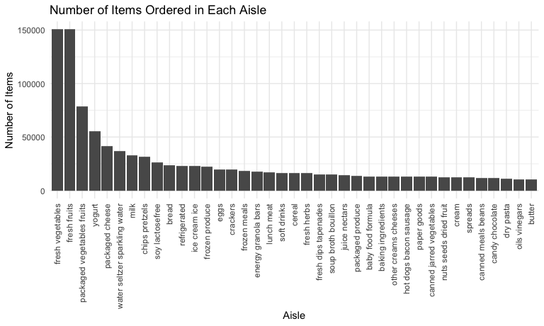

p8105_hw3_ksf2129
================
Kimia Faroughi
2025-10-08

## Problem 1

**Load the dataset**

``` r
library(tidyverse)
library(p8105.datasets)
data("instacart")

#global ggplot settings
knitr::opts_chunk$set(
  fig.width = 8,
  fig.asp = .6,
  out.width = "90%"
)

theme_set(theme_minimal() + theme(legend.position = "bottom"))

options(
  ggplot2.continuous.colour = "viridis",
  ggplot2.continuous.fill = "viridis"
)

scale_colour_discrete = scale_colour_viridis_d
scale_fill_discrete = scale_fill_viridis_d
```

Import the weather data.

``` r
data("weather_df")

weather_df =
  weather_df |> 
  mutate(month = floor_date(date, unit = "month"))
```

There are 1384617 rows (observations) and 15 columns (variables) in the
`instacart` dataset. Each row in the dataset is a unique product from an
order from instacart. Variable names in this dataset include: order_id,
product_id, add_to_cart_order, reordered, user_id, eval_set,
order_number, order_dow, order_hour_of_day, days_since_prior_order,
product_name, aisle_id, department_id, aisle, department. Some variables
of note are `product_id` (the product identifier), `user_id` (the
customer identifier), `product_name` (name of the product ordered),
`aisle` (name of the aisle the product is in), and `department` (name of
the department the product is in). For example, for the product `49302`
and customer `112108`, the product ordered was `Bulgarian Yogurt`, which
was in the `dairy eggs` department in the `yogurt` aisle.

**Explore dataset further**

There are 134 different (unique) aisles in the dataset.

``` r
instacart |> 
  group_by(aisle) |> 
  summarize(
    n = n() #gives number of obs
  ) |> 
  arrange(desc(n))
```

    ## # A tibble: 134 × 2
    ##    aisle                              n
    ##    <chr>                          <int>
    ##  1 fresh vegetables              150609
    ##  2 fresh fruits                  150473
    ##  3 packaged vegetables fruits     78493
    ##  4 yogurt                         55240
    ##  5 packaged cheese                41699
    ##  6 water seltzer sparkling water  36617
    ##  7 milk                           32644
    ##  8 chips pretzels                 31269
    ##  9 soy lactosefree                26240
    ## 10 bread                          23635
    ## # ℹ 124 more rows

The most items are ordered from the fresh vegetables and fresh fruits
aisles, followed by the packaged vegetables fruits, yogurt, and packaged
cheese aisles.

**Plot showing the number of items ordered in each aisle, limited to
aisles with more than 10000 items ordered:**

``` r
instacart |> 
  group_by(aisle) |> 
  summarize(
    n = n()
  ) |> 
  filter(n > 10000) |> 
  arrange(desc(n)) |> 
  mutate(aisle = fct_inorder(aisle)) |> #put aisle in order of how it appears in data
  ggplot(aes(x = aisle, y = n)) +
  geom_col() +
  theme(axis.text.x = element_text(angle = 90, hjust = 1, vjust = 0.5)) +
  labs(
    x = "Aisle",
    y = "Number of Items",
    title = "Number of Items Ordered in Each Aisle"
  )
```


